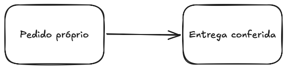
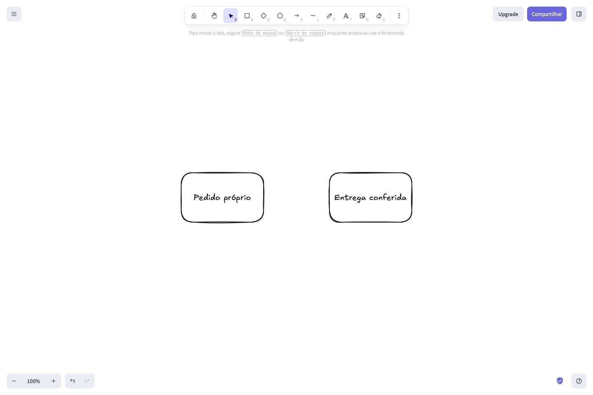
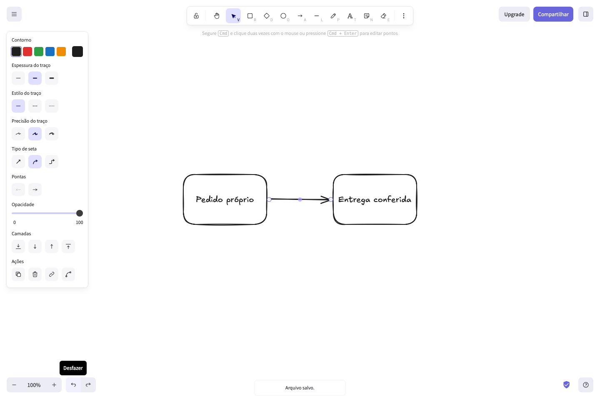

# Excalidraw: guardar um desenho e continuar trabalhando nele

Use o arquivo editável para continuar o desenho em outra sessão. Use o PNG quando precisar apenas da imagem. Guarde os dois: o armazenamento do navegador pode ser apagado.

## 1. Criar um fluxo simples

Escolha **Retângulo** e arraste para desenhar uma caixa. Pressione Enter para escrever dentro dela e clique fora para concluir. Repita para uma segunda caixa. Escolha **Flecha** e arraste entre as caixas. Volte para **Seleção** ao terminar.

O exemplo abaixo tem duas caixas, dois textos e uma flecha. É um desenho próprio fictício.

## 2. Baixar a imagem

No menu superior esquerdo, escolha **Exportar imagem...**. Deixe **Fundo** ligado e escala **1×**. Clique **Exportar como PNG** e confira que o arquivo apareceu na pasta de downloads. A ação **Copiar para a área de transferência** não cria uma cópia de segurança.

[Baixar a imagem PNG própria](https://github.com/joaodeluca/product-knowledge-operations/releases/download/help-2026-10-05/diagram.png)

## 3. Guardar o desenho editável

No menu, escolha **Salvar como...** → **Salvar em um arquivo**. Guarde o arquivo com extensão `.excalidraw`, sem substituir essa extensão por `.png`. A imagem PNG e o arquivo editável têm funções diferentes.

[Baixar o desenho editável próprio](https://github.com/joaodeluca/product-knowledge-operations/releases/download/help-2026-10-05/scene-original.excalidraw)

## 4. Continuar em outra sessão

Abra uma sessão vazia do Excalidraw. Clique **Abrir** e selecione o arquivo `.excalidraw` que você guardou. Confira o texto, as caixas e a flecha antes de editar. A posição do desenho na tela pode mudar porque o produto o centraliza ao abrir.

Nesta amostra, a abertura em uma sessão separada conservou os cinco elementos do desenho. A imagem exportada depois da abertura ficou igual à imagem original. Essa conferência é desta amostra, não uma garantia de recuperação de todos os arquivos.

## 5. Recuperar uma exclusão recente

Com **Seleção** ativa, clique na flecha visível e pressione Delete. Confirme que ela desapareceu.

Clique **Desfazer**. A flecha deve reaparecer ligada às caixas.

**Desfazer** ajuda a corrigir uma edição recente. Ele não substitui uma cópia de segurança e não garante recuperar armazenamento apagado, outra sessão ou um arquivo sobrescrito. Antes de alterar um trabalho importante, guarde uma nova cópia do arquivo editável.

## Arquivos e alcance da conferência

As imagens e o arquivo editável desta página são próprios. Você pode baixar os arquivos originais nas ligações acima. O [manifesto público](../../dist/excalidraw/files/manifest.json) identifica os quatro arquivos. Também estão disponíveis as capturas de [exclusão](https://github.com/joaodeluca/product-knowledge-operations/releases/download/help-2026-10-05/connector-deleted.png) e [recuperação](https://github.com/joaodeluca/product-knowledge-operations/releases/download/help-2026-10-05/connector-recovered.png). Essas capturas registram esta amostra; não são garantia geral do produto.

Procedimento observado em 05/10/2026, no produto público https://excalidraw.com/, interface Português Brasileiro. A amostra de 04/10 permanece com seu resultado histórico parcial. Este material não comprova trabalho aceito por um cliente, economia de tempo ou manutenção contratada.
